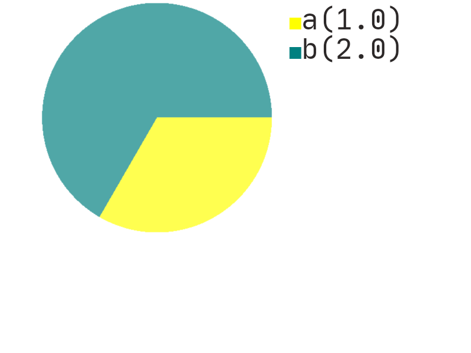
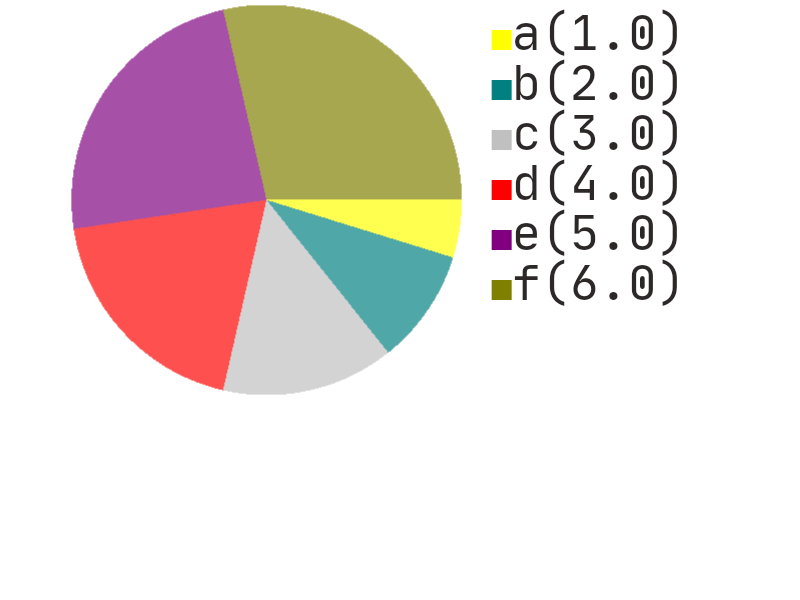
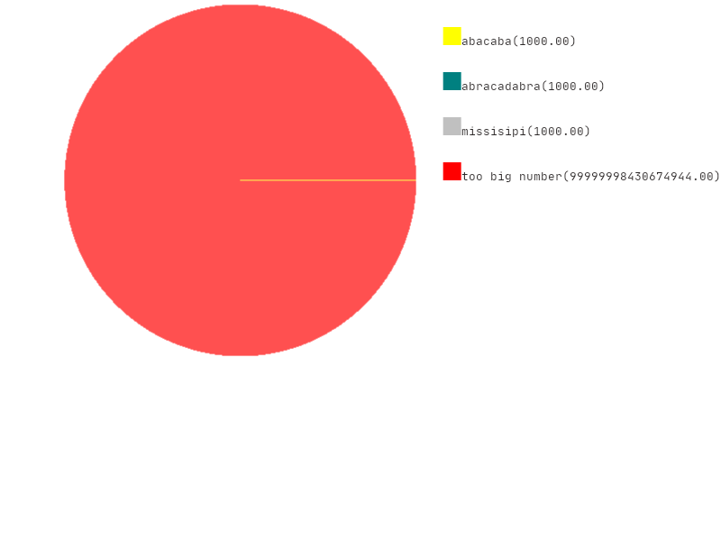
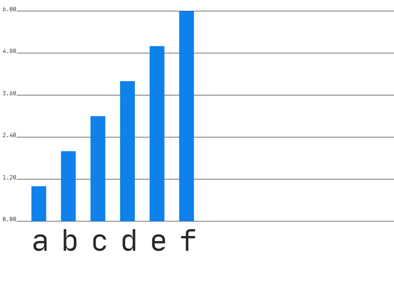
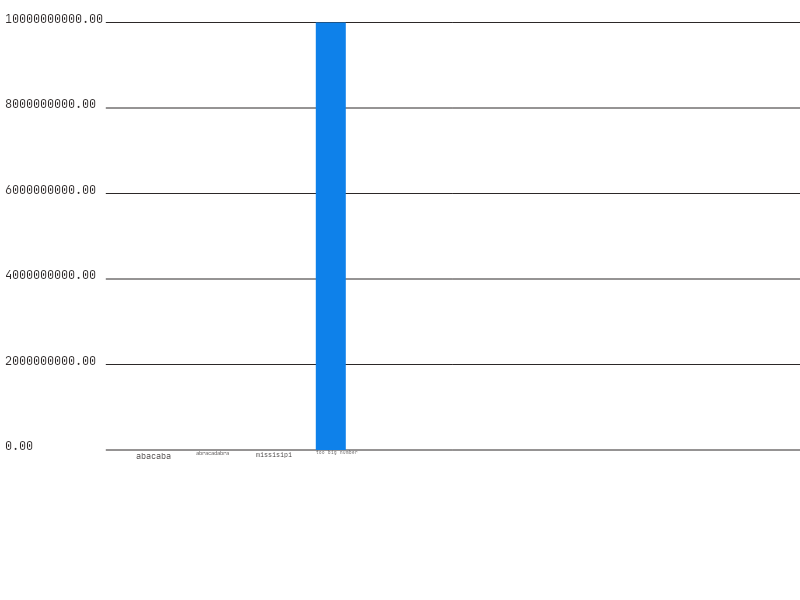

# Курс основ программирования на МКН СПбГУ
## Проект 3: визуализация данных

[Постановка задачи](./TASK.md)

# *User guide*

---

## Using

You can run the program with IDE

Then you should write commands

First, you should write type of diagram.

+ circle
+ bar

Then write data in format --

```VALUE1 NAME1```

```VALUE2 NAME2```

```VALUE3 NAME3```

```...```

```VALUE``` is a floating point number. ```NAME``` is name of ```VALUE```.

Between ```VALUE``` and ```NAME``` should be at least 1 space.

```NAME``` can contains spaces.

To stop input just press ENTER

---

## Examples











